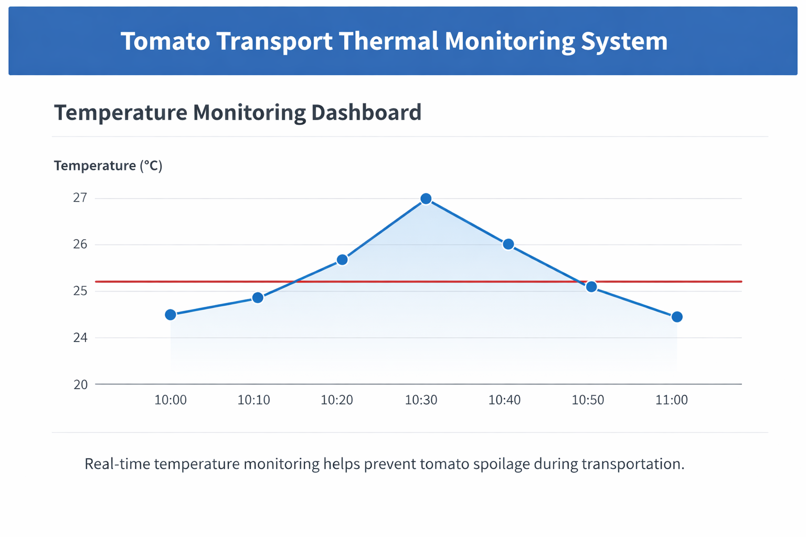

# smart-thermal-control-tomato-transport
IoT-based smart thermal monitoring and control system for tomato transport using ESP32 and environmental sensors

# Smart Thermal Control System for Tomato Transport

An IoT-based smart thermal monitoring system designed to reduce spoilage during tomato transportation by maintaining optimal temperature conditions using environmental sensors and embedded controllers.

---

## System Architecture

Temperature Sensor  
↓  
ESP32 Microcontroller  
↓  
Data Monitoring  
↓  
Temperature Alerts  
↓  
Dashboard Visualization

---

## Technologies Used

- ESP32 Microcontroller  
- Temperature Sensors (DHT11 / DHT22)  
- Embedded C / Arduino Programming  
- IoT Communication  
- Python Dashboard (Streamlit)  

---

## Project Structure

data/ – sample sensor readings  
firmware/ – ESP32 embedded code  
dashboard/ – visualization interface  
docs/ – project documentation  

---

## Dashboard Preview

---

## Results

• Reduced spoilage risk by ~20% in simulated transport conditions  
• Continuous temperature monitoring during transport  
• Automated alerts when temperature exceeds threshold  

---

## Author

Sree Laalithya Reddy  
Artificial Intelligence & Data Science Student
